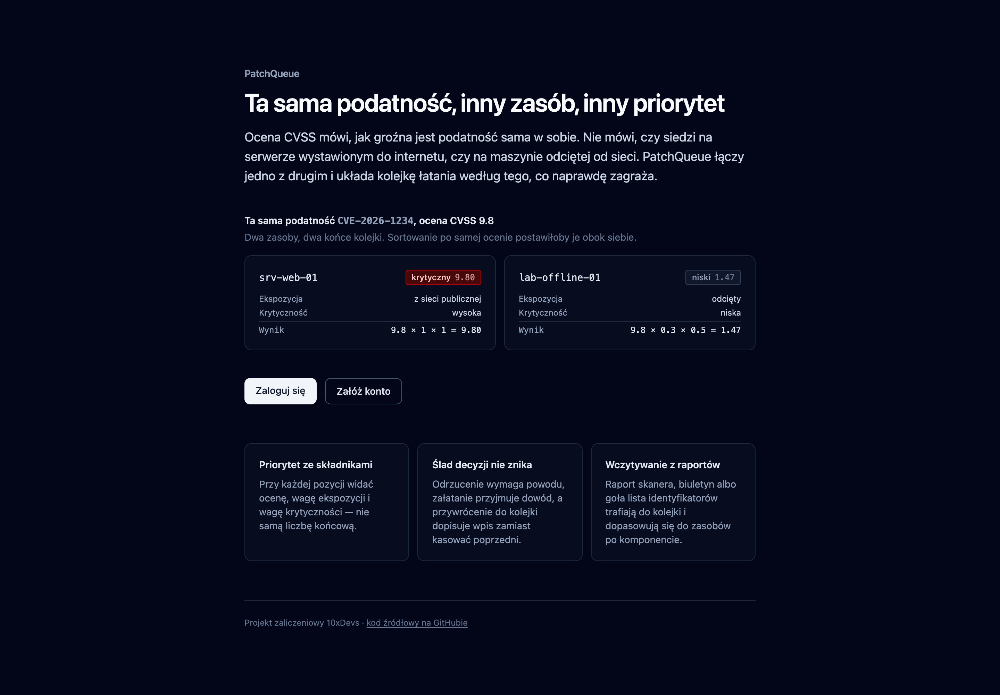

# PatchQueue

**Kolejka łatania podatności, która wie, gdzie dana podatność stoi.**

Ocena CVSS mówi, jak groźna jest podatność sama w sobie. Nie mówi, czy siedzi na serwerze
wystawionym do internetu, czy na maszynie odciętej od sieci. PatchQueue łączy jedno
z drugim i układa kolejkę według tego, co naprawdę zagraża.



**Aplikacja na żywo:** https://patchqueue.paszekkrystian-19.workers.dev

## Na czym polega różnica

Ta sama podatność `CVE-2026-1234` z oceną **9.8** na dwóch różnych zasobach:

| Zasób            | Ekspozycja         | Krytyczność | Wynik           | Priorytet          |
| ---------------- | ------------------ | ----------- | --------------- | ------------------ |
| `srv-web-01`     | z sieci publicznej | wysoka      | 9.8 × 1 × 1     | **krytyczny 9.80** |
| `lab-offline-01` | odcięty            | niska       | 9.8 × 0.3 × 0.5 | **niski 1.47**     |

Sortowanie po samej ocenie CVSS postawiłoby je obok siebie. Tu dzieli je cała kolejka.

Obie skale są ściśle malejące, więc reguła „podatność na zasobie wystawionym nigdy nie
ląduje niżej niż ta sama podatność na zasobie odciętym" nie jest założeniem, którego trzeba
pilnować — jest własnością konstrukcyjną iloczynu, sprawdzaną testem na pełnej siatce
kombinacji.

## Co jeszcze robi

- **Priorytet ze składnikami** — przy każdej pozycji widać ocenę, wagę ekspozycji i wagę
  krytyczności, nie samą liczbę końcową. Priorytet nie jest przechowywany; wynika z reguły
  i liczy się przy odczycie, żeby nie mógł się rozjechać ze stanem zasobu.
- **Ślad decyzji, którego nie da się zatrzeć** — odrzucenie wymaga powodu, załatanie
  przyjmuje dowód, a przywrócenie do kolejki dopisuje wpis zamiast kasować poprzedni.
  Tabela historii nie ma polityki `UPDATE` ani `DELETE`, więc reguła obowiązuje też przy
  zapisie z pominięciem aplikacji.
- **Wczytywanie z zewnętrznych źródeł** — raport skanera w CSV, biuletyn bezpieczeństwa
  albo goła lista identyfikatorów, z pliku lub wklejone. Znaleziska dopasowują się do
  zasobów po komponencie; niedopasowane są raportowane, a nie pomijane po cichu.
- **Guardraile egzekwowane przez bazę** — zasobu z otwartymi pozycjami nie da się usunąć
  (odmowa wymienia blokujące), a ta sama podatność nie może stać dwa razy na tym samym
  zasobie.

## Stack

| Warstwa          | Wybór                                                                              |
| ---------------- | ---------------------------------------------------------------------------------- |
| Framework        | [Astro 6](https://astro.build/) w trybie SSR, wyspy [React 19](https://react.dev/) |
| Język            | TypeScript 5                                                                       |
| Style            | [Tailwind CSS 4](https://tailwindcss.com/)                                         |
| Logowanie i baza | [Supabase](https://supabase.com/) — z politykami dostępu na poziomie wierszy       |
| Wdrożenie        | [Cloudflare Workers](https://workers.cloudflare.com/)                              |

Uzasadnienie wyboru i przyjęte ryzyka: [`context/foundation/tech-stack.md`](./context/foundation/tech-stack.md).

## Uruchomienie lokalne

Wymagania: Node.js 22.14.0 (patrz `.nvmrc`) oraz [Docker](https://www.docker.com/), jeśli
chcesz postawić Supabase lokalnie.

```bash
npm install
cp .env.example .env        # dla Node
cp .env.example .dev.vars   # dla lokalnego środowiska Cloudflare
```

### Baza

Projekt ma **trzy tabele i cztery migracje** — bez nich aplikacja nie działa.

```bash
npx supabase start          # stawia lokalny stos i stosuje migracje z supabase/migrations
```

Skopiuj `SUPABASE_URL` i klucz `anon` wypisane przez CLI do `.env` oraz `.dev.vars`.
Lokalne Studio: `http://localhost:54323`.

Wobec projektu w chmurze migracje wypycha się przez `npx supabase db push` po wcześniejszym
`npx supabase login` i `npx supabase link --project-ref <ref>`.

Dane demonstracyjne: `node scripts/seed.mjs`.

### Start

```bash
npm run dev                 # http://localhost:4321
```

## Skrypty

| Komenda                     | Co robi                                             |
| --------------------------- | --------------------------------------------------- |
| `npm run dev`               | serwer deweloperski (środowisko workerd)            |
| `npm run build`             | build produkcyjny (SSR przez `@astrojs/cloudflare`) |
| `npm run preview`           | podgląd builda                                      |
| `npm run lint` / `lint:fix` | ESLint z regułami opartymi o typy                   |
| `npm run typecheck`         | `astro check`                                       |
| `npm test`                  | Vitest — 83 testy jednostkowe i integracyjne        |
| `npm run test:e2e`          | Playwright — 16 scenariuszy                         |

Testy przeciw wdrożonej instancji:

```bash
BASE_URL=https://patchqueue.paszekkrystian-19.workers.dev npx playwright test
```

## Bramki jakości

`lint` → `typecheck` → testy jednostkowe i integracyjne → testy przeglądowe → build →
wdrożenie → **ponowna weryfikacja żywej instancji tym samym zestawem testów**.

Do tego pięć reguł [`dependency-cruiser`](./.dependency-cruiser.cjs), z których dwie
pilnują, żeby moduł domenowy nie sięgał do bazy, HTTP ani widoku — dzięki czemu zdanie
„reguła domenowa nie zależy od niczego" jest sprawdzane, a nie deklarowane.

Pipeline: [`.github/workflows/ci.yml`](./.github/workflows/ci.yml). Osobny workflow
[`impl-review.yml`](./.github/workflows/impl-review.yml) uruchamia agenta przeglądającego
implementację względem planu zmiany i komentującego pull requesty.

## Struktura

```
src/
├── lib/domain/        # reguła priorytetu i agregat — bez zależności zewnętrznych
├── lib/services/      # warstwa danych, rozdzielona wzdłuż pojęć domenowych
├── pages/             # strony i punkty końcowe
└── components/        # widok (Astro; React tylko tam, gdzie potrzebna interaktywność)
supabase/migrations/   # schemat, polityki dostępu, wyzwalacze, funkcje
tests/integration/     # reguły egzekwowane w bazie — bez atrap
e2e/                   # ścieżki użytkownika
context/               # dokumenty projektu (poniżej)
```

## Dokumenty

| Plik                                                                   | Po co                                                      |
| ---------------------------------------------------------------------- | ---------------------------------------------------------- |
| [`context/foundation/prd.md`](./context/foundation/prd.md)             | wymagania, historyjki, guardraile                          |
| [`context/foundation/test-plan.md`](./context/foundation/test-plan.md) | mapa ryzyka i kucharka testów                              |
| [`context/foundation/fr-audit.md`](./context/foundation/fr-audit.md)   | audyt wszystkich wymagań względem kodu                     |
| [`context/map/repo-map.md`](./context/map/repo-map.md)                 | mapa repozytorium z jawnym zasięgiem pomiaru               |
| [`context/domain/`](./context/domain/)                                 | destylacja domeny, niezmienniki, plan odcięcia od dostawcy |
| [`RAPORT-ARCHITEKTONICZNY.md`](./RAPORT-ARCHITEKTONICZNY.md)           | co pokazały cztery badania architektoniczne                |
| [`CLAUDE.md`](./CLAUDE.md)                                             | komendy, konwencje i reguły domenowe dla agenta            |

Projekt zaliczeniowy 10xDevs 3.0.
