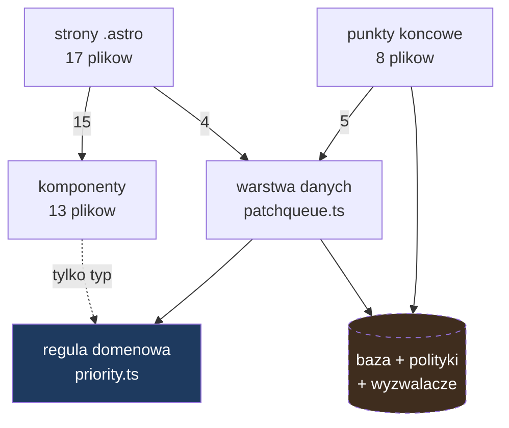

# Artefakt 2 — Struktura (graf zależności)

Data: 2026-08-21
Narzędzie: `dependency-cruiser` 17.x, konfiguracja w `.dependency-cruiser.cjs`
Uzupełnienie: `scripts/astro-graph.mjs` — patrz „Zasięg pomiaru"

## Najważniejsze obserwacje

1. **Narzędzie samo w sobie nie widziało połowy systemu.** `dependency-cruiser` nie
   parsuje plików `.astro`, więc 16 plików warstwy widoku — w tym każda strona wołająca
   warstwę danych — było poza grafem. Pierwszy przebieg pokazał 27 modułów i „zero
   naruszeń"; po dołożeniu brakującej warstwy okazało się, że krawędzi jest dwa razy
   więcej. Wynik „czysto" z niepełnego zasięgu jest nieodróżnialny od „nie widziałem".
2. **Zero cykli w całym grafie.** Nie ma ani jednego cyklu zależności, także po
   uwzględnieniu widoku.
3. **Moduł domenowy jest szczelny.** `src/lib/domain/priority.ts` nie zależy od niczego
   — ani od bazy, ani od frameworka, ani od żadnej biblioteki zewnętrznej. Pilnują tego
   dwie reguły w konfiguracji narzędzia, więc naruszenie zatrzyma się na lincie, a nie
   na przeglądzie kodu.
4. **Jeden wyraźny węzeł: warstwa danych.** `src/lib/services/patchqueue.ts` to
   najdłuższy plik w repozytorium (335 linii) i zależy od niego 9 modułów — wszystkie
   punkty końcowe i wszystkie strony operujące na danych. To naturalne miejsce zmiany
   przy rozbudowie i jednocześnie najgęstsze skupisko odpowiedzialności.
5. **Jedno przejście przez warstwę.** `PriorityBadge.astro` importuje moduł domenowy
   bezpośrednio, z pominięciem warstwy danych. To import wyłącznie typu (`PriorityClass`),
   więc nie tworzy sprzężenia w czasie wykonania — ale warto o nim wiedzieć.

## Zasięg pomiaru

| Warstwa | Objęta grafem | Metoda |
|---|---|---|
| `.ts`, `.tsx` (25 plików) | tak | analiza składniowa `dependency-cruiser` |
| `.astro` (16 plików) | tak, ale osobno | odczyt importów z frontmatteru, `scripts/astro-graph.mjs` |
| SQL (migracje, wyzwalacze) | **nie** | `unknown` — brak narzędzia; zależności bazy nie są w grafie |
| Reguły dostępu w bazie | **nie** | `unknown` — sprawdzane wyłącznie testami integracyjnymi |

Krawędzie z plików `.astro` pochodzą z prostszej metody niż reszta grafu: wyrażenie
regularne po instrukcjach `import` we frontmatterze. Wystarcza, bo w tych plikach
importy są statyczne i stoją w jednym miejscu — ale to jest odczyt tekstu, nie analiza
składniowa, i tak należy go ważyć.

**SQL jest poza grafem w całości.** Trzy guardraile produktu żyją w wyzwalaczach i
politykach dostępu, a żadne narzędzie w tym zestawieniu ich nie widzi. Zmiana w
`supabase/migrations/` nie zapali się w żadnym grafie zależności — jedyną siatką
bezpieczeństwa są tam testy integracyjne.

## Przepływ między warstwami

Kierunek jest jednolity: widok i punkty końcowe → warstwa danych → reguła domenowa.
Reguła nie oddzwania do nikogo. Baza jest narysowana przerywaną linią, bo leży poza
zasięgiem pomiaru.

## Sprzężenia

| Obszar | Co znaleziono | Dowód | Dlaczego ważne przy zmianie |
|---|---|---|---|
| `src/lib/services/patchqueue.ts` | 9 modułów zależnych; najdłuższy plik | graf, 335 linii | Każda zmiana kształtu danych dotyka wszystkich punktów końcowych i stron naraz |
| `src/lib/domain/priority.ts` | zero zależności wychodzących | graf + reguła w lincie | Da się zmieniać i testować w izolacji; to jedyny taki moduł |
| `src/types.ts` | wspólny kontrakt dla warstwy danych i widoku | graf | Zmiana kontraktu rozchodzi się na oba końce jednocześnie |
| migracje SQL | brak jakichkolwiek krawędzi | `unknown` | Zmiana wyzwalacza nie zapali się nigdzie poza testami integracyjnymi |

## Co sprawdzić dalej

Warstwa danych łączy w jednym pliku cztery obowiązki: mapowanie wierszy na kontrakty,
operacje na zasobach, operacje na podatnościach i budowanie kolejki. Przy dokładaniu
wczytywania z zewnętrznych źródeł ten plik urośnie o kolejny, obcy mu obowiązek —
tłumaczenie cudzych formatów. To jest kandydat numer jeden do rozdzielenia i punkt
wyjścia dla rankingu w następnym kroku.
