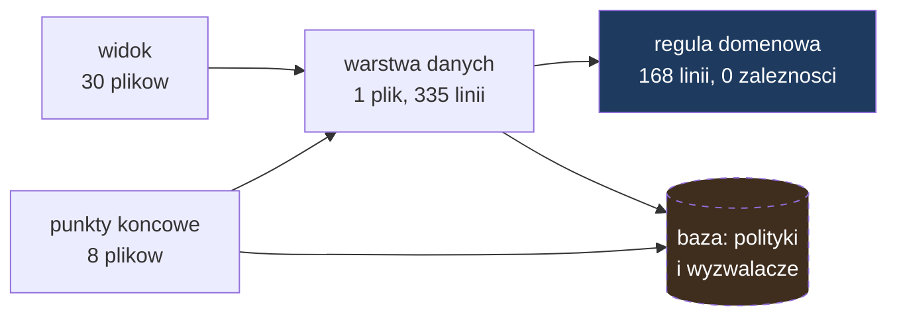

# Mapa repozytorium — PatchQueue

Data: 2026-08-21
Źródła: `artifact-1-territory.md`, `artifact-2-structure.md`, `artifact-3-contributors.md`

## TL;DR

PatchQueue układa kolejkę łatania podatności, łącząc ocenę CVSS z ekspozycją i
krytycznością zasobu, na którym dana podatność stoi. Repozytorium jest małe i młode:
41 plików źródłowych, 19 commitów, dwa dni historii, jeden autor. Warstwy układają się
w jeden kierunek — widok i punkty końcowe wołają warstwę danych, ta woła regułę
domenową, reguła nie oddzwania do nikogo. Nie ma ani jednego cyklu zależności.
Najgęstszym punktem jest warstwa danych: jeden plik na 335 linii, od którego zależy
dziewięć modułów. Największym ryzykiem nie jest jednak kod, lecz to, czego graf nie
obejmuje — trzy guardraile produktu żyją w SQL-u, poza zasięgiem jakiegokolwiek
narzędzia w tym zestawieniu.

## Teren

| Obszar | Pliki | Linie | Charakter |
|---|---|---|---|
| `src/pages` | 17 | 1143 | Strony i punkty końcowe — najszersza, ale płytka warstwa |
| `src/lib` | 7 | 817 | Reguła domenowa, warstwa danych, klient bazy, pomocnicze |
| `src/components` | 13 | 777 | Widok; połowa odziedziczona po starterze |
| `tests` + `e2e` | 2 | 546 | Dowody: izolacja kont i ścieżka użytkownika |
| `supabase/migrations` | 2 | 241 | Schemat, polityki dostępu, wyzwalacze |

**Moduły głębokie:** `src/lib/domain/priority.ts` (cała logika produktu, zero
zależności) i `src/lib/services/patchqueue.ts` (cały dostęp do danych).
**Moduły płytkie:** wszystkie strony `.astro` i punkty końcowe — cienkie, delegują dalej.

Aktywność w czasie nie niesie sygnału przy dwudniowej historii — patrz artefakt 1.

## Realne powiązania

Co naprawdę zmienia się razem, według grafu (a nie według historii, która jest za krótka):

- **Warstwa danych ↔ wszystko, co operuje na danych.** Dziewięć modułów zależnych.
  Zmiana kształtu danych rozchodzi się na pięć punktów końcowych i cztery strony naraz.
- **`src/types.ts` ↔ oba końce.** Wspólny kontrakt między warstwą danych a widokiem.
- **Reguła domenowa ↔ nic.** Jedyny moduł, który da się zmienić bez dotykania reszty.
  To nie przypadek — dwie reguły w konfiguracji `dependency-cruiser` tego pilnują.
- **Migracje SQL ↔ `unknown`.** Żadnych krawędzi w grafie, mimo że kod bazy realnie
  decyduje o zachowaniu aplikacji.

Zero cykli w całym grafie, wliczając warstwę widoku.

## Strefy ryzyka

| Strefa | Dlaczego ryzykowna |
|---|---|
| `supabase/migrations/` | Trzy guardraile produktu żyją tutaj, a żadne narzędzie statyczne ich nie widzi. Jedyna siatka to testy integracyjne. |
| `src/lib/services/patchqueue.ts` | Najdłuższy plik, dziewięciu zależnych, cztery obowiązki w jednym miejscu. Każda rozbudowa domyślnie ląduje właśnie tu. |
| Warstwa widoku poza grafem | Narzędzie nie parsuje `.astro`; krawędzie znamy z prostszego odczytu tekstu. Import dynamiczny albo nietypowy zapis umknie. |
| Formularze uwierzytelniania | Odziedziczone po starterze wyspy Reactu ze stanem kontrolowanym. Dwa realne błędy już stąd wyszły — autouzupełnianie i zapętlona sesja. |
| Sprzężenie z jednym dostawcą | Logowanie i baza pochodzą od tego samego dostawcy; awaria dotyka obu naraz. Ryzyko przyjęte świadomie, zapisane w `tech-stack.md`. |

## Kogo zapytać

Nie dotyczy — jeden autor. Rolę pamięci zespołu pełnią dokumenty kontekstowe; mapowanie
pytań na pliki jest w artefakcie 3.

## Pierwszy dzień — co przeczytać po kolei

1. `context/foundation/prd.md` — po co to istnieje, czego nie wolno złamać
2. `src/lib/domain/priority.ts` — jedyna reguła, którą podejmuje aplikacja
3. `src/lib/domain/priority.test.ts` — ta sama reguła widziana od strony zachowania
4. `supabase/migrations/20260820150000_initial_schema.sql` — model danych i guardraile w bazie
5. `src/lib/services/patchqueue.ts` — jak dane wchodzą i wychodzą
6. `src/pages/queue.astro` — jak to wygląda dla użytkownika
7. `tests/integration/isolation.test.ts` — dowód, że konta są rozdzielone
8. `.github/workflows/ci.yml` — co musi przejść, żeby zmiana wjechała na produkcję

## Ograniczenia

- **Okno czasowe:** 2 dni, 19 commitów, 1 autor. Analiza aktywności i autorstwa nie ma
  tu zastosowania — to ograniczenie metody wobec młodego repozytorium, nie wynik.
- **Metoda:** graf `.ts`/`.tsx` z analizy składniowej; graf `.astro` z odczytu importów
  wyrażeniem regularnym; SQL bez pokrycia.
- **Czego mapa NIE mówi:** nic o zachowaniu w czasie wykonania, nic o zależnościach
  wewnątrz bazy, nic o kosztach wydajnościowych. Mówi, co od czego zależy w kodzie —
  i wyłącznie tam, gdzie sięgnęły narzędzia.
